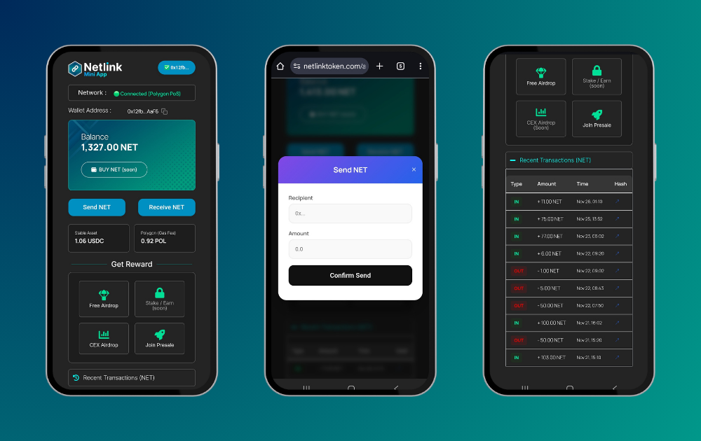

This section outlines how Netlink Token (NET) is currently used in real applications within the ecosystem. At this stage, Netlink focuses on a single, foundational application designed to introduce users to the ecosystem in a simple and accessible way.

## Netlink Mini App (Beta)

The Netlink Mini App (Beta) serves as the initial application within the Netlink ecosystem. It functions as a lightweight entry point that allows users to interact with NET and become familiar with the core mechanics of the ecosystem.

The Mini App is intentionally designed to be simple, accessible, and easy to use, prioritizing usability over feature complexity during the early stage of development.

### Mini App Preview

### Access the Mini App

The Netlink Mini App (Beta) is accessible at:

https://netlinktoken.com/app

Users are encouraged to access the application only through official Netlink channels and verify the URL before connecting any wallet.

## What Users Can Do Today

At its current stage, the Netlink Mini App (Beta) enables users to:

- View NET token balances  
- Connect and interact with supported Web3 wallets  
- Access the Netlink ecosystem through a unified interface  
- Prepare for participation in future community-driven utilities  

These features represent the foundational layer of interaction rather than a complete set of ecosystem utilities.

## Design Philosophy

The Netlink Mini App is built with a **simplicity-first** approach. Instead of introducing advanced features early, the application focuses on lowering the barrier to entry and helping users understand how NET fits into the broader ecosystem.

Key design considerations include:

- Minimal user friction  
- Mobile-friendly interaction  
- Clear and intuitive interface  
- Compatibility with widely used Web3 standards  

## Current Limitations

As a beta application, the Netlink Mini App has limited functionality. Some utilities described elsewhere in the documentation may not yet be available through the app.

This limitation is intentional and reflects Netlink’s iterative development approach, where functionality evolves in response to real usage and community feedback rather than predefined assumptions.

## Path Forward

The Netlink Mini App (Beta) is intended to serve as a foundation for future applications and integrations. As the ecosystem grows, additional utilities and features may be introduced based on actual demand and validated use cases.

Any significant updates or new applications will be documented transparently as they become available.
